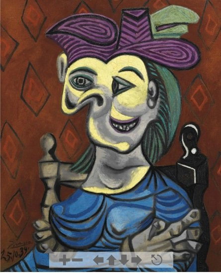
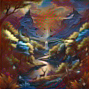

# 🎨 Neural Style Transfer (Dockerized Streamlit App)

Ứng dụng **Neural Style Transfer** cho phép bạn tạo ra những bức ảnh nghệ thuật bằng cách kết hợp **nội dung (content)** của một ảnh và **phong cách (style)** của một ảnh khác — tất cả được đóng gói trong **Docker container**, dễ dàng chạy ở bất kỳ đâu.

  
  
  

---

## 🚀 1. Giới thiệu

Đây là một ứng dụng **Streamlit + PyTorch** được triển khai để thực hiện thuật toán **Neural Style Transfer** (NST).

Ứng dụng chạy trực tiếp trên Docker, không cần cài môi trường Python thủ công.  
Chỉ cần một dòng lệnh duy nhất là bạn đã có thể chạy webapp AI này ngay trên máy tính của mình.

---

## 🐳 2. Cách cài đặt và chạy bằng Docker Hub

Bước 1: Pull image từ Docker Hub

Chạy lệnh sau để tải image từ repository Docker Hub của bạn:

docker pull thang1311/neural-style-transfer:latest

🔹 Bước 3: Chạy ứng dụng

Sau khi pull xong, chạy container bằng lệnh:

docker run -d -p 8501:8501 --name nst thang1311/neural-style-transfer:latest

Sau đó mở trình duyệt truy cập:

👉 http://localhost:8501

🔧 3. Build thủ công (nếu muốn tự tạo image)

Nếu bạn muốn tùy chỉnh code và tự build image, làm như sau:

# Clone project về máy
git clone https://github.com/thang1311/neural-style-transfer.git
cd neural-style-transfer

# Build image từ Dockerfile
docker build -t neural-style-transfer .

# Chạy container
docker run -d -p 8501:8501 neural-style-transfer
